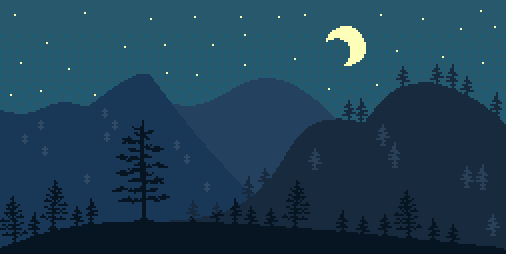

<div align="center">

# Clove ⁷

*"I build systems in the dark and think in possibilities."*

<br/>



</div>

---

<div align="center">

I'm a systems analyst who works at **[Kayzen](https://github.com/clove7)** —
building low-level infrastructure in **Rust**.
I care more about how things work underneath than what they look like on the surface.
I think in layers, move slowly on purpose, and tend to see patterns before I see details.

Outside the terminal, I live in imagined worlds,
collect moments from side characters, and find meaning in quiet things.

</div>

---

<div align="center">

### ⬡ Stack & Tools


<br/>


</div>

---

<div align="center">

### ◈ Activity


<br/>


</div>

---

<div align="center">

### ✦ Behind the code

```
→  I think in systems. I write in silence.
→  Side characters matter more than the main plot.
→  Still building something no one has seen yet.
```

</div>

---

<div align="center">
<sub>pixel art by <a href="https://giphy.com/kaijupxl">@kaijupxl</a> · working at Kayzen</sub>
</div>
